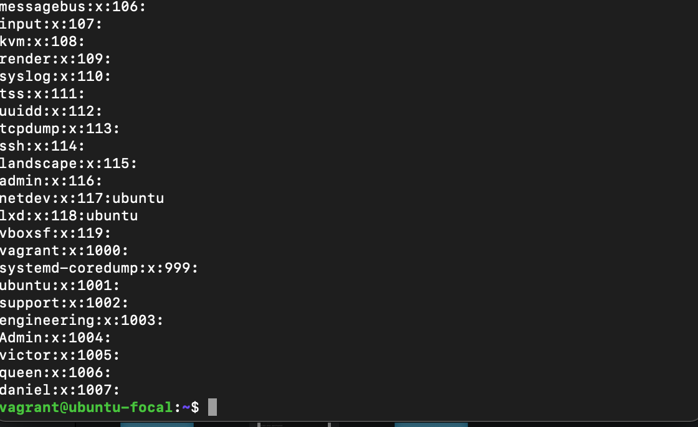

# altschool-cloud-exercise

## Exercise 1

This is the output of ifconfig after configuring dhcp

## Exercise 3
 This is the output of cat /etc/group
 

 This is the output of cat /etc/passwd
 

 This is the output of ssh key gen
 ![ssh key gen] (ssh key gen.png)

 ## Exercise 4
 Install php7.4
 ![install php7.4] (php 7.4.png)