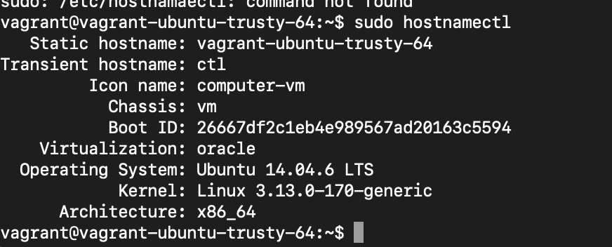
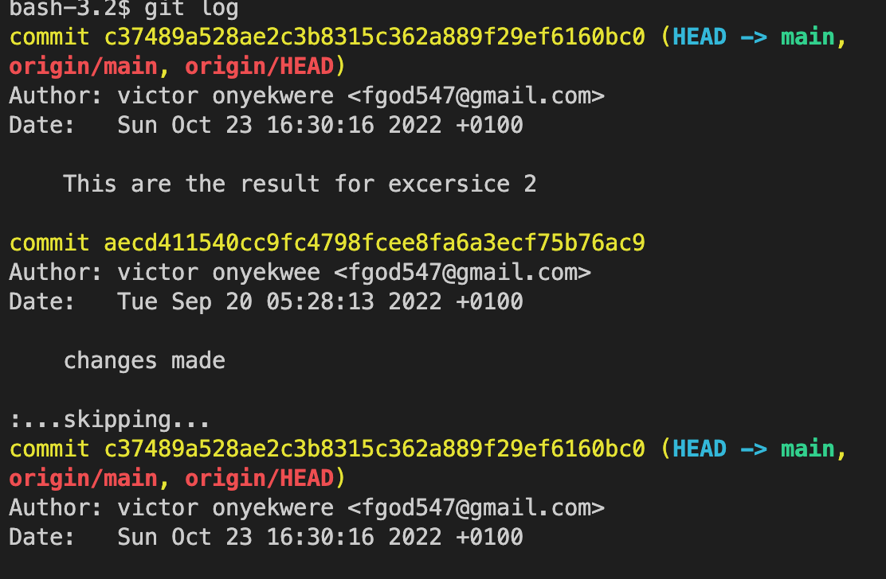

# altschool-cloud-exercise

## Exercise 1

This is the output of ifconfig after configuring dhcp

# Exercise 2
# 10 most common used linux commands
 This is the output of echo 
 echo command is used to display the line of text that are passed as arguments

 This is the output of ls
 
 ls command is used to list file and directory

 This is the output of passwd
 
pwd command is used to find the present working directory       

This is the output of passwd

passwd command is used to
change the password of the user

This is the output of root

 is used by a computer  to execute commands with privileges of another user account 

 This is the output of uname
 
 its a utility to check the system information on your linux computer 

  This is the output of cat
  
  its used to print the content of a file 

  This is the output for du
  
  its used display the number of blocks used for file

  This is the output for hostnamectl
  
  it provides a proper api used to control linux system hostname and change its related settings 
## Exercise 3
 This is the output of cat /etc/group
 

 This is the output of cat /etc/passwd
 

 This is the output of ssh key gen
 ![ssh key gen] (ssh key gen.png)

 ## Exercise 4
 Install php7.4
   

 # Exercise 6
 This is the output of 
 git log
 

  This is the output of git config -l

  This is the output of git remote
    

  # Exercise 9
  This is the output of excercise 9
  network ip = 32 =193.16.20.32
  Broadcast IP = 39 =193.16.20.32
  Hosts = 6 
  IP Adesses = 6
  Subnet mask = 255.255.248
  Class E      